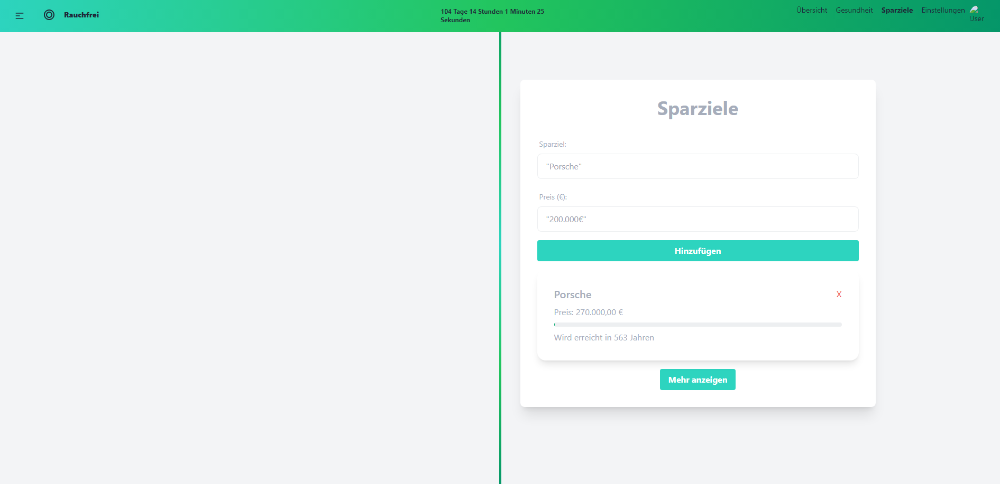

# Rauchfrei Website Version 2

Willkommen zur Version 2 unserer Rauchfrei Website! Diese neue Version bietet ein verbessertes Design und erweiterte Funktionen, um Sie auf Ihrem Weg zur Rauchfreiheit zu unterstützen.

## Über die Website

Unsere Website ist ein hilfreiches Tool für alle, die den Wunsch haben, mit dem Rauchen aufzuhören. Sie bietet verschiedene Funktionen, um den Fortschritt Ihrer Rauchentwöhnung zu verfolgen und Sie zu motivieren.

## Neue Funktionen

In der Version 2 haben wir einige neue Funktionen hinzugefügt und bestehende Funktionen verbessert:

- **Neues Design:** Wir haben das Design der Website komplett überarbeitet, um eine verbesserte Benutzererfahrung zu bieten.
- **Erweiterter Geldsparrechner:** Sehen Sie genau, wie viel Geld Sie durch das Aufhören mit dem Rauchen gespart haben.
- **Erweiterte Gesundheitsverfolgung:** Erhalten Sie detailliertere Informationen darüber, wie sich Ihre Gesundheit seit dem Rauchstopp verbessert hat.
- **Individuelle Sparziele:** Sie können nun individuelle Sparziele setzen und Ihren Fortschritt verfolgen.

## Zukünftige Pläne

Wir planen, in Zukunft weitere Verbesserungen und Funktionen hinzuzufügen, darunter:

- Implementierung von Firebase für eine verbesserte Datenverwaltung.
- Weitere Personalisierungsoptionen für Sparziele.
- Implementierung von Accounts

Wir freuen uns, Sie auf Ihrem Weg zur Rauchfreiheit zu begleiten und hoffen, dass unsere Website Ihnen dabei hilft, Ihre Ziele zu erreichen. Vielen Dank, dass Sie sich für einen rauchfreien Lebensstil entschieden haben!

## Screenshots

### Übersicht

### Gesundheit

### Sparen

